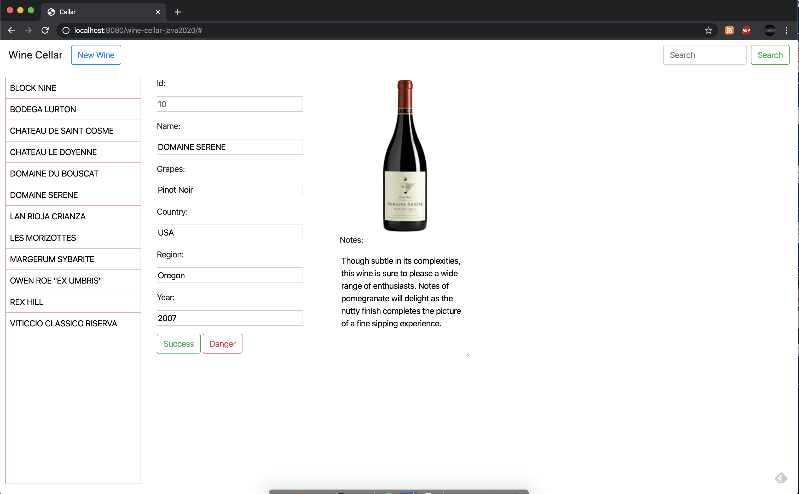

# Wine Cellar Application #

This is my version of the Wine Cellar application, that is inspired by [this](https://github.com/ccoenraets/wine-cellar-java) application.

This application provides an example of 
Building a complete RESTful API in Java using JAX-RS and Jersey.
Consuming these services using jQuery

My version of the application differs from the original version:
	- Uses Maven for dependency management
	- Java libraries (JAX related) are notorious to break with different version of the web server. This current version is working as of April 2020.
	- Cosmetic changes to use Bootstrap (Although I am still learning UI ;) )

Set Up:

1. Create a MySQL 5.7.29 database name "cellar".
2. Execute cellar.sql to create and populate the "wine" table:

	mysql cellar -uroot < cellar.sql

3. Import the Maven Project in Eclipse.
4. Locate cellar.properties and make sure the JDBC connection string matches your database configuration
5. Run the project on a standalone Tomcat 7 server.

Here's a screenshot of the project:

Wine Cellar App: 
